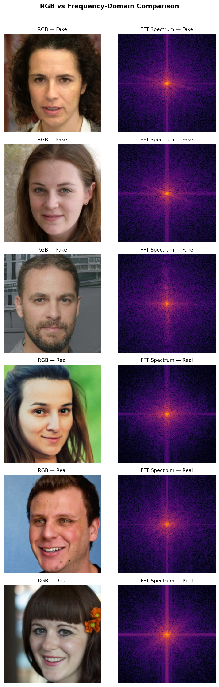
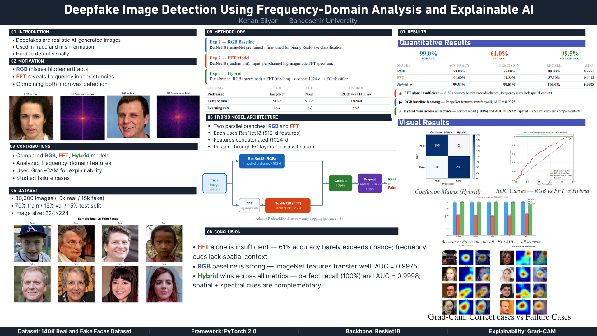
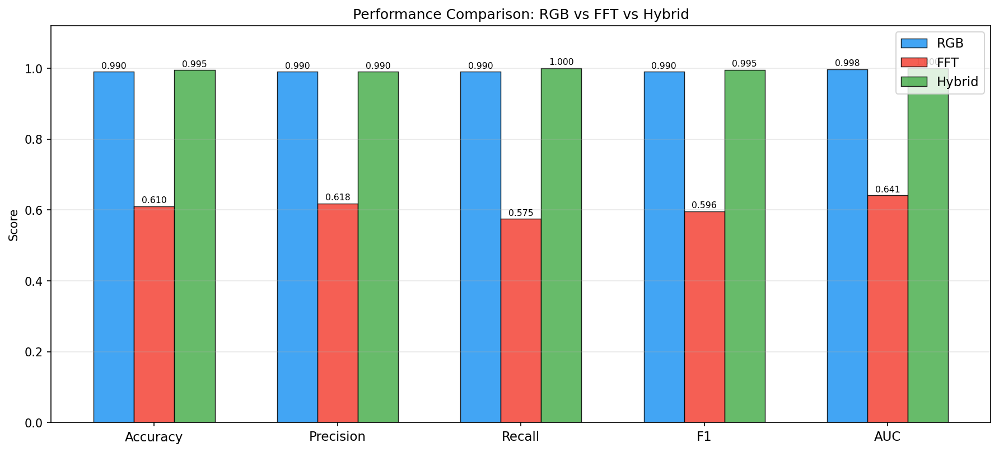
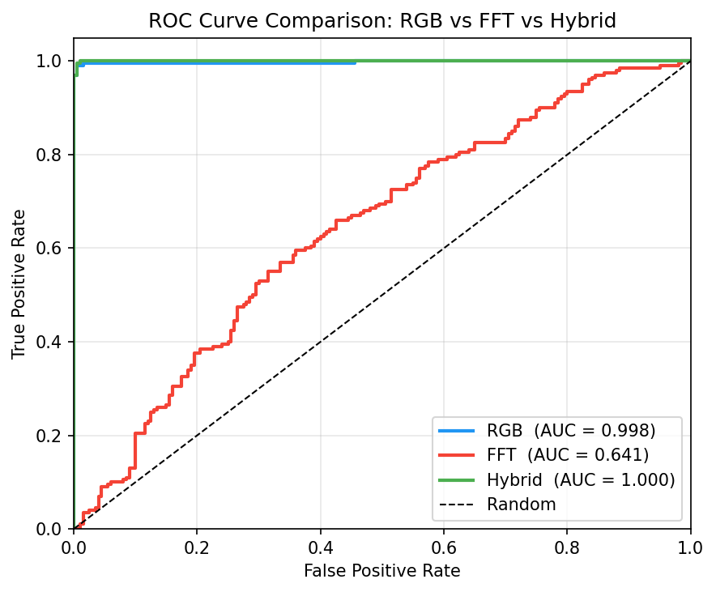
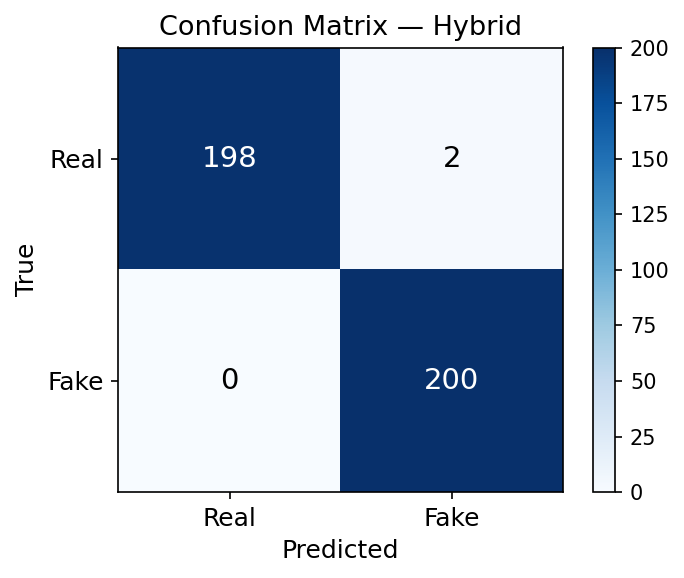

# Deepfake Image Detection Using Frequency-Domain Analysis and Explainable AI

<p align="center">
  
</p>

<p align="center">
  
  
  
  
</p>

> **University Final Project — Bahcesehir University, Artificial Intelligence Engineering, 2026**  
> Author: **Kenan Eliyan**

A PyTorch deep-learning project that compares three deepfake-detection strategies:
**RGB-only**, **FFT-only (frequency domain)**, and a **Hybrid fusion** model,
augmented with **Grad-CAM** explainability to visualise model decisions.

---

## Project Poster

<p align="center">
  
</p>

<p align="center">
  📄 <a href="poster/poster.pdf"><strong>Download Full Poster (PDF)</strong></a>
</p>

---

## Table of Contents

1. [Overview](#overview)
2. [Results](#results)
3. [Methodology](#methodology)
4. [Dataset](#dataset)
5. [Project Structure](#project-structure)
6. [Installation](#installation)
7. [Usage](#usage)
8. [Outputs](#outputs)
9. [Future Work](#future-work)

---

## Overview

Deepfake faces generated by GANs contain subtle **frequency artifacts** introduced by
transposed-convolution upsampling — invisible to the human eye but detectable in the
FFT magnitude spectrum.

This project tests the hypothesis:
> *Combining spatial (RGB) and spectral (FFT) cues in a single model outperforms
> either modality alone.*

Three experiments are run under identical conditions:

| # | Experiment | Input | Backbone | Pretrained |
|---|-----------|-------|----------|------------|
| 1 | **RGB** | Raw 224×224 face image | ResNet18 | ✅ ImageNet |
| 2 | **FFT** | Log-magnitude FFT spectrum (3-ch) | ResNet18 | ❌ Scratch |
| 3 | **Hybrid** | RGB + FFT (dual branch, late fusion) | 2× ResNet18 | RGB ✅ / FFT ❌ |

Grad-CAM heatmaps are generated for correct predictions and failure cases to
understand *where* each model looks.

---

## Results

Final results on the held-out test set (4,500 images — 2,250 real + 2,250 fake):

| Model | Accuracy | Precision | Recall | F1 | AUC |
|-------|----------|-----------|--------|----|-----|
| RGB | 99.00% | 99.00% | 99.00% | 0.990 | 0.9975 |
| FFT | 61.00% | 61.83% | 57.50% | 0.594 | 0.6412 |
| **Hybrid ★** | **99.50%** | **99.01%** | **100.0%** | **0.995** | **0.9998** |

**Key findings:**

- 🔴 **FFT alone is insufficient** — 61% barely exceeds chance; spectral cues need
  spatial context.
- 🔵 **RGB is a strong baseline** — ImageNet pretraining transfers surprisingly well to
  deepfake detection (AUC = 0.9975).
- 🟢 **Hybrid wins across all metrics** — perfect recall (0 false negatives), AUC =
  0.9998; spatial and spectral cues are genuinely complementary.

<p align="center">
  
</p>

<p align="center">
  
  &nbsp;&nbsp;
  
</p>

---

## Methodology

### FFT Preprocessing

For each input image the FFT branch computes:

```
image (H×W×3)
  → per-channel 2-D DFT (numpy.fft.fft2)
  → fftshift (zero-frequency centred)
  → log-magnitude: log(|FFT| + ε)
  → min-max normalise to [0, 1]
  → apply ImageNet mean/std for consistent input scale
  → 224×224×3 tensor
```

### Hybrid Architecture

```
Face image  →  ResNet18 (ImageNet) →  512-d features ──┐
                                                        ├→ Concat (1024-d)
FFT spectrum →  ResNet18 (scratch) →  512-d features ──┘
                                                   ↓
                              Dropout(0.4) → FC(1024 → 256) → ReLU
                                                   ↓
                                  Dropout(0.3) → FC(256 → 2)
                                                   ↓
                                            Real / Fake
```

Grad-CAM hooks are attached to the last convolutional layer of the RGB ResNet18 branch.

### Training Configuration

| Setting | RGB | FFT | Hybrid |
|---------|-----|-----|--------|
| Backbone | ResNet18 | ResNet18 | 2× ResNet18 |
| Pretrained | ImageNet | No | RGB branch only |
| Learning rate | 1e-4 | 1e-3 | 5e-5 |
| Optimiser | Adam | Adam | Adam |
| Scheduler | ReduceLROnPlateau | ReduceLROnPlateau | ReduceLROnPlateau |
| Early stopping | patience = 3 | patience = 3 | patience = 3 |
| Batch size | 32 | 32 | 32 |
| Training images | 21,000 | 21,000 | 21,000 |

---

## Dataset

**140K Real and Fake Faces** — available on Kaggle:  
🔗 https://www.kaggle.com/datasets/xhlulu/140k-real-and-fake-faces

The dataset contains 70,000 real faces (Flickr/FFHQ) and 70,000 StyleGAN2-generated
fake faces. This project uses a balanced 30,000-image subset.

### Getting the Data

1. Download and unzip the Kaggle archive.
2. Run the preparation script to copy a balanced subset into `data/`:

```bash
python src/prepare_data.py --source /path/to/kaggle/archive

# Example (Windows):
python src/prepare_data.py --source "C:/Downloads/archive"

# Custom size (default is 30,000):
python src/prepare_data.py --source /path/to/archive --total 20000
```

This creates:

```
data/
├── train/   real/ (10,500)   fake/ (10,500)
├── val/     real/  (2,250)   fake/  (2,250)
└── test/    real/  (2,250)   fake/  (2,250)
```

> ⚠️ **The `data/` directory is not tracked by Git** (820 MB). See the Kaggle link
> above to download the source images.

---

## Project Structure

```
deepfake-frequency-detection/
│
├── src/                          # Core library
│   ├── __init__.py
│   ├── dataset.py                # DeepfakeDataset, DataLoader factory
│   ├── fft_utils.py              # FFT transforms, spectrum visualisation
│   ├── models.py                 # RGBModel, FFTModel, HybridModel (ResNet18)
│   ├── train.py                  # Training loop, early stopping, history
│   ├── evaluate.py               # Metrics, confusion matrix, ROC curves
│   ├── gradcam.py                # Grad-CAM implementation + grid saving
│   ├── visualize.py              # Training curves, sample grids, bar charts
│   └── prepare_data.py           # Dataset preparation script
│
├── train_rgb.py                  # Experiment 1 — RGB baseline
├── train_fft.py                  # Experiment 2 — FFT frequency model
├── train_hybrid.py               # Experiment 3 — Hybrid fusion
├── evaluate_all.py               # Load all models, evaluate, plot
│
├── results/
│   ├── figures/                  # All generated plots (committed)
│   ├── metrics/                  # Per-model JSON metrics (committed)
│   └── models/                   # *.pth weights (gitignored) + history JSON
│
├── notebooks/
│   └── exploration.ipynb         # Interactive walkthrough
│
├── poster/
│   ├── poster.pdf                # Academic poster (PDF)
│   └── poster_preview.png        # Poster preview image
│                                 # (poster.html source is gitignored)
│
├── requirements.txt
├── .gitignore
└── README.md
```

---

## Installation

### 1. Clone the repository

```bash
git clone https://github.com/Spideyman198/deepfake-frequency-detection.git
cd deepfake-frequency-detection
```

### 2. Create a virtual environment

```bash
python -m venv venv

# Windows
venv\Scripts\activate

# macOS / Linux
source venv/bin/activate
```

### 3. Install dependencies

```bash
pip install -r requirements.txt
```

> **GPU**: PyTorch will automatically use CUDA if available. Tested on CUDA 11.8 / 12.1.
> CPU training works but is ~10× slower.

### 4. Prepare the dataset

```bash
python src/prepare_data.py --source /path/to/kaggle/archive
```

---

## Usage

### Train all three models

```bash
python train_rgb.py       # Experiment 1: RGB baseline
python train_fft.py       # Experiment 2: FFT frequency model
python train_hybrid.py    # Experiment 3: Hybrid fusion
```

**Common flags** (all three scripts share the same interface):

| Flag | Default | Description |
|------|---------|-------------|
| `--data_dir` | `data` | Path to the prepared dataset directory |
| `--epochs` | `10` | Maximum training epochs |
| `--batch_size` | `32` | Mini-batch size |
| `--max_samples` | `0` | Training images (0 = use all available) |
| `--patience` | `3` | Early-stopping patience |
| `--backbone` | `resnet18` | `resnet18` or `efficientnet_b0` |
| `--lr` | model-specific | Override the learning rate |
| `--num_workers` | `0` | DataLoader worker processes |

**Examples:**

```bash
# Quick smoke-test with 2,000 images
python train_rgb.py --max_samples 2000 --epochs 3

# Full training run
python train_rgb.py --max_samples 0 --epochs 20

# EfficientNet-B0 backbone
python train_hybrid.py --backbone efficientnet_b0
```

### Evaluate all models

```bash
python evaluate_all.py
```

This loads all three saved checkpoints, runs them on the test split, and writes every
visualisation to `results/figures/` and `results/metrics/`.

```bash
# Evaluate specific models only
python evaluate_all.py --models rgb hybrid

# Use the full test set
python evaluate_all.py --max_samples 0

# More Grad-CAM examples
python evaluate_all.py --gradcam_n 10
```

### Interactive exploration

```bash
jupyter notebook notebooks/exploration.ipynb
```

Walks through: data visualisation, FFT comparison, model inference demo, Grad-CAM
step-by-step, and cross-model metric comparison.

---

## Outputs

After running all three training scripts and `evaluate_all.py`:

```
results/
├── figures/
│   ├── rgb_vs_fft_comparison.png      ← Spatial vs frequency domain
│   ├── metrics_comparison.png         ← Grouped bar chart (5 metrics)
│   ├── roc_combined.png               ← All three ROC curves overlaid
│   ├── roc_hybrid.png                 ← Hybrid ROC curve
│   ├── confusion_matrix_hybrid.png    ← Hybrid confusion matrix
│   ├── failure_cases_hybrid.png       ← Hybrid failure gallery
│   ├── gradcam_rgb/                   ← Grad-CAM correct + failure (RGB)
│   │   ├── gradcam_correct.png
│   │   └── gradcam_incorrect.png
│   ├── gradcam_fft/                   ← Grad-CAM correct + failure (FFT)
│   │   ├── gradcam_correct.png
│   │   └── gradcam_incorrect.png
│   └── gradcam_hybrid/                ← Grad-CAM correct + failure (Hybrid)
│       ├── gradcam_correct.png
│       └── gradcam_incorrect.png
│
├── metrics/
│   ├── rgb_metrics.json               ← {accuracy, precision, recall, f1, auc}
│   ├── fft_metrics.json
│   ├── hybrid_metrics.json
│   └── all_metrics_summary.json       ← Combined results table
│
└── models/
    ├── rgb_model_history.json         ← Per-epoch loss/accuracy
    ├── fft_model_history.json
    └── hybrid_model_history.json
    # *.pth weight files are gitignored (too large)
```

---

## Future Work

- **Larger dataset**: Training on the full 140K images would likely close the remaining
  0.5% accuracy gap between RGB and Hybrid.
- **Attention fusion**: Replace late concatenation with a cross-attention mechanism that
  learns which frequency bands matter most for each spatial region.
- **Generalisation**: Evaluate on out-of-distribution deepfakes (Stable Diffusion,
  FaceSwap) to test robustness beyond StyleGAN artifacts.
- **Real-time inference**: Optimise and quantise the Hybrid model for deployment in
  browser or mobile contexts.
- **Video detection**: Extend to video by processing temporal consistency across frames
  in addition to per-frame predictions.

---

## License

This project is released under the **MIT License** for academic and educational use.

---

## Acknowledgements

- Dataset: [140K Real and Fake Faces](https://www.kaggle.com/datasets/xhlulu/140k-real-and-fake-faces) — Kaggle
- Backbone: [ResNet18](https://arxiv.org/abs/1512.03385) — He et al., 2016
- Explainability: [Grad-CAM](https://arxiv.org/abs/1610.02391) — Selvaraju et al., 2017
- Bahcesehir University, Artificial Intelligence Engineering Department
